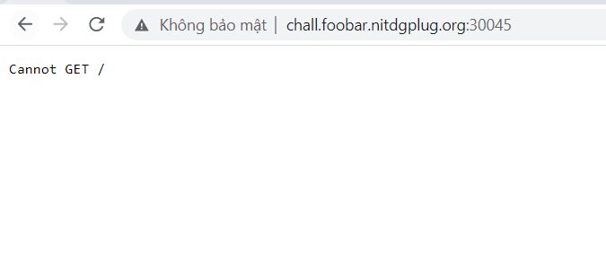

# inspect (WEB)

## Description:  Nghĩ đơn giản thôi, làm cho nó chạy là được!!!
> url: http://chall.foobar.nitdgplug.org:30045/

## Solution:
Sau khi truy cập và url ta nhận được màn hình trắng tinh với dòng chữ Cannot GET /

