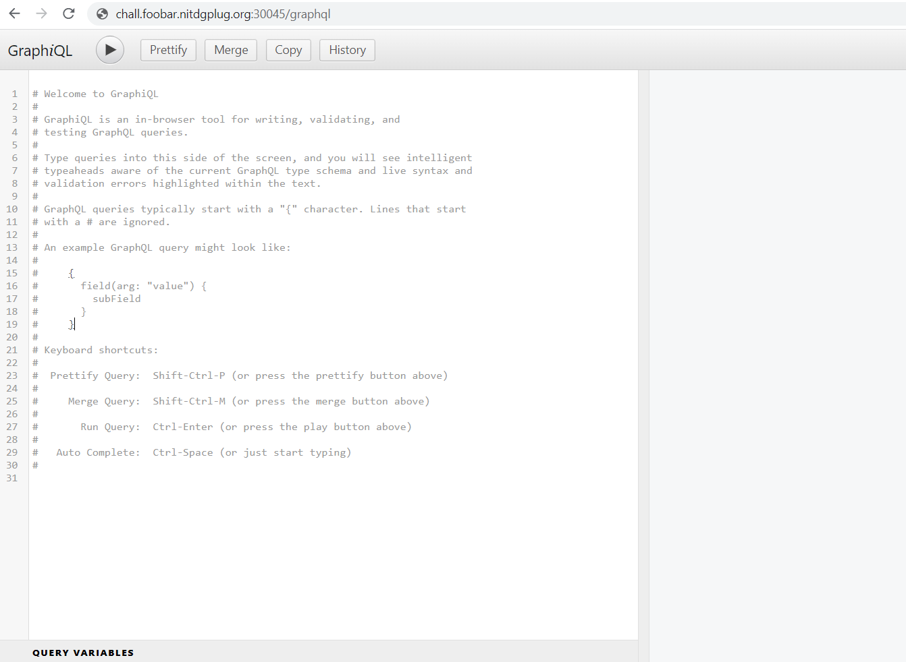
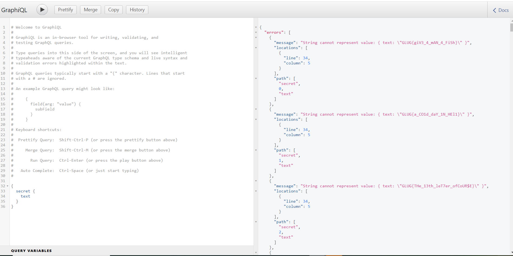
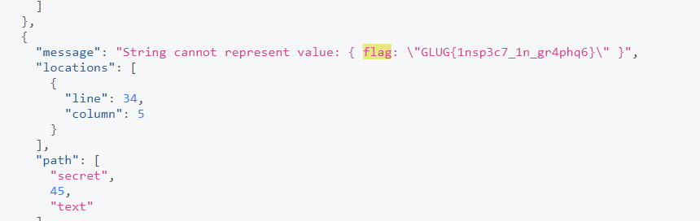

# inspect (WEB)

## Description:  Nghĩ đơn giản thôi, làm cho nó chạy là được!!!
> url: http://chall.foobar.nitdgplug.org:30045/

## Solution:
Sau khi truy cập và url ta nhận được màn hình trắng tinh với dòng chữ Cannot GET /


Bước đầu tiên thì cứ dùng dirsearch để quét thư mục trước đã.
Mình tìm thấy một đường dẫn sau:
> http://chall.foobar.nitdgplug.org:30045/graphql

Đoán chừng bài khẳ năng là trích xuất thông tin của Object trong graphQL.



Thử payload:

> {__schema{types{name,fields{name}}}}

Payload này hoạt động tức là chức năng Introspection được enabled.

payload: liệt kê toàn bộ Object

Đây là lược đồ cho đối tượng RootQuery, là điểm bắt đầu cho tất cả các truy vấn trong API GraphQL. Lược đồ xác định cấu trúc của đối tượng RootQuery, bao gồm tên, mô tả và các trường của nó. Đây là một sự cố của lược đồ:

Đối tượng RootQuery có bốn trường: secret, events, bookings, login.
Trường bí mật trả về danh sách các đối tượng Flag không rỗng.
Trường sự kiện trả về một danh sách các đối tượng Sự kiện không phải là null.
Trường đăng ký trả về một danh sách các đối tượng Đăng ký không rỗng.
Trường đăng nhập có hai đối số, tên người dùng và mật khẩu, cả hai đều là đối tượng Chuỗi không null. Nó trả về một đối tượng AuthData không null.
Mỗi trường trong đối tượng RootQuery có tên, mô tả, danh sách đối số (nếu có), loại và trạng thái ngừng sử dụng. Loại của từng trường có thể là loại vô hướng (như Chuỗi), loại đối tượng (như Sự kiện hoặc Đặt chỗ) hoặc danh sách hoặc trình bao bọc không null xung quanh một loại (như danh sách không null của các đối tượng Sự kiện không null) .


vì vậy chúng ta cần query vào trường secret để gọi tới đối tượng Flag. 


Để trích xuất thông tin của trường text trong đối tượng Flag, bạn có thể sử dụng truy vấn GraphQL như sau:

```php
{
  secret {
    text
  }
}

```
Trong đó, secret là tên trường trong RootQuery chứa danh sách các đối tượng Flag. text là trường cần trích xuất từ mỗi đối tượng Flag. Kết quả trả về sẽ là một danh sách các giá trị text từ các đối tượng Flag trong trường secret.



Ok bây giờ chúng ta có được một đống cờ giả.

search từ khoá : flag ta nhận được cờ thật

