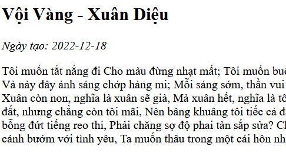
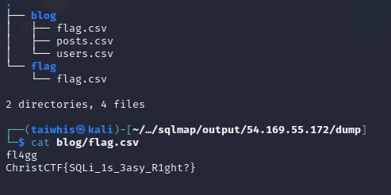

[WED](#web)

# Blog of "LoveSicker"
WEB

## Solution
giao diện web :

dùng dirsearch để tìm các thư mục ẩn 
sau đó mình lại chạy các payload phổ biến để check lỗi.
kết quả mình tìm thấy thư mục Display_Post.php có param là id.
payload này hoạt động: /Display_Post.php?id=1337/(3*2-5)

tiếp tục mình lại cho request vào 1.txt và chạy sqlmap.
và nhận được flag

flag: ChristCTF{SQLi_1s_3asy_R1ght?}

