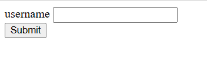
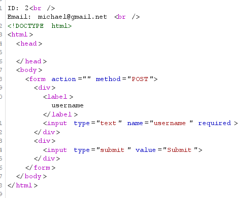

[WED](#web)

# SQL Routed
WED

## Solution
giao diện web như này:

mình nhập lung tung vào thì không thấy gì xảy ra cả.

bắt request và test thử một vài dấu hiệu hay gặp thì mình thấy payload này hoạt động: 
> -1' OR 3*2*1=6 AND 000700=000700 --

Không hiểu sao nó in ra được thông tin của ID = 2

Điều này cho thấy có thể tấn công sql injection ở đây.

mình đưa luôn toàn bộ request vào file 1.txt và chạy sqlmap.
> sqlmap -r 1.txt --dump-all --threads=5

flag chính là mật khẩu trong database.

"bài này chạy lâu quá, làm lại chưa lấy được flag"

