# catch me if you can
WEB

10 Point

## Description
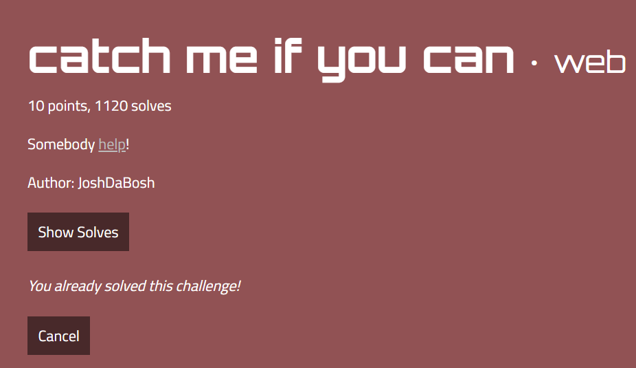

Link: https://catch-me-if-you-can.web.actf.co

## Solution
Mình truy cập vào link được hướng dẫn thì mình thấy luôn flag đang được quay vòng vòng trên màn hình.
Mình vào source và lấy flag

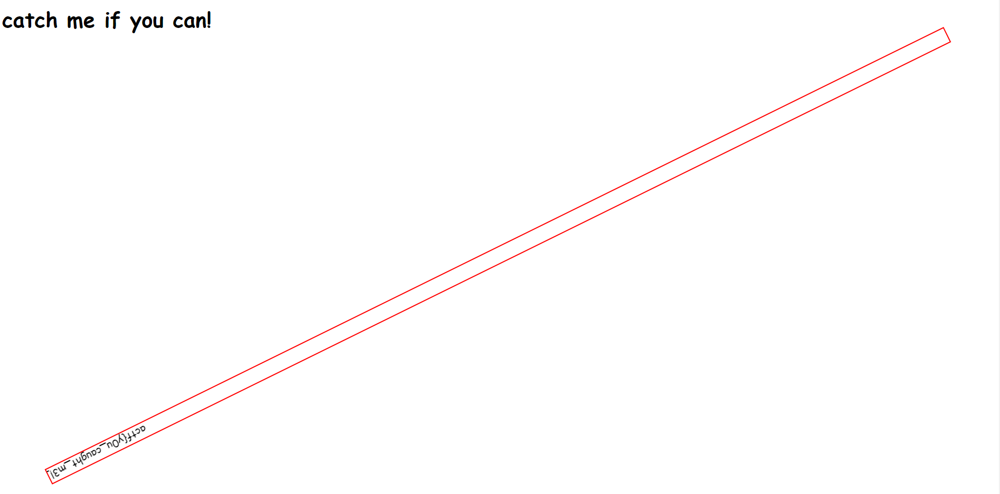

flag: actf{y0u_caught_m3!_0101ff9abc2a724814dfd1c85c766afc7fbd88d2cdf747d8d9ddbf12d68ff874}

# Celeste Speedrunning Association
WEB

20 Point

## Description
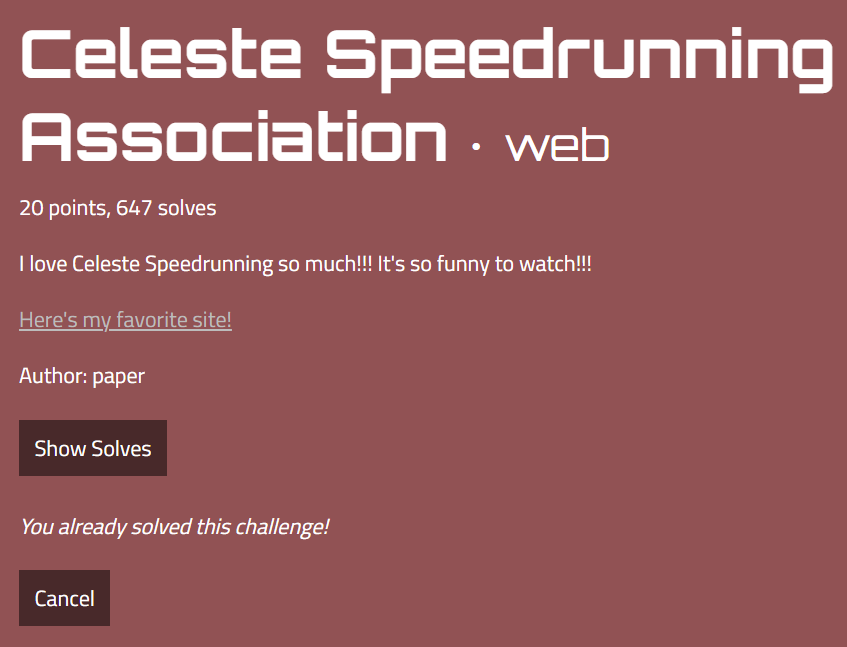

## Solution
Trước tiên thì mình vào web và nhận được cái giai diện như này.
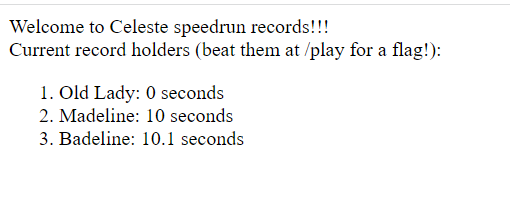

giao diện này nói rằng flag ở trong /play
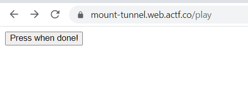

Sau khi truy cập vào /play tôi nhận được một cái botton
Nó bảo rằng mình cần phải đánh bại được kỷ lục trước đó để nhận được flag.

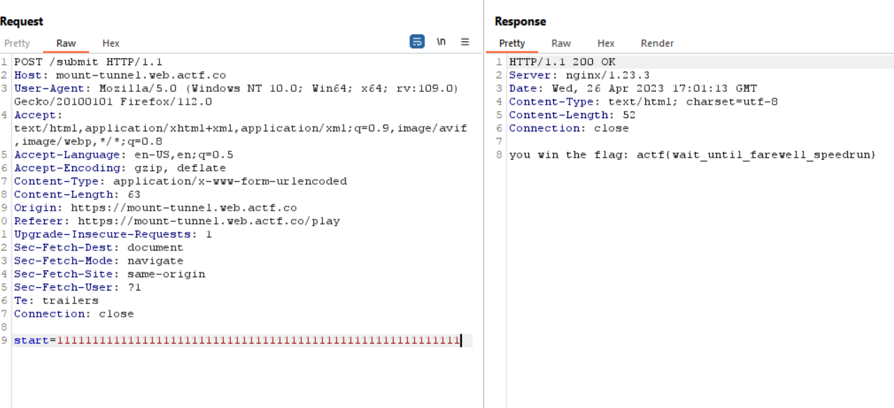

chỉ cần nhập một số thật lớn vào là được rồi

flag: actf{wait_until_farewell_speedrun}

# shortcircuit
WEB

40 Point

## Description
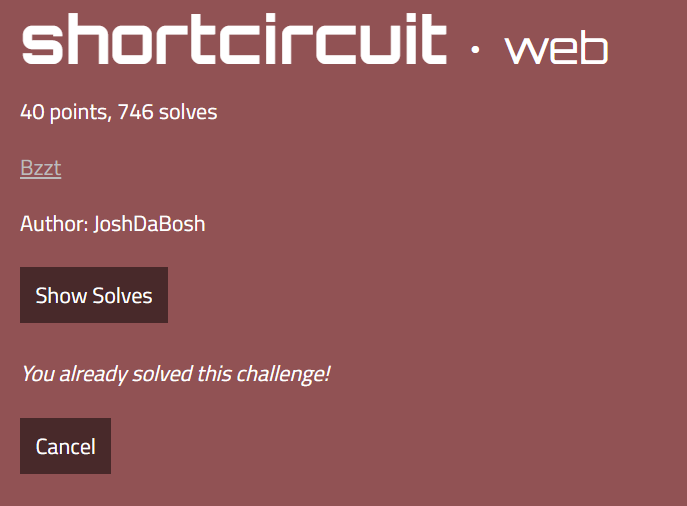
Link: https://shortcircuit.web.actf.co

## Solution
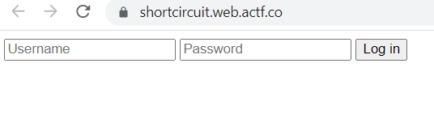

có vẻ như trang web này yêu cầu nhập đúng username và password để lấy được flag
tôi thực hiện đọc source và thấy một đoạn code javascirpt sau.
tôi chú ý ở hàm này: 
```js
const check = (e) => {
                if (document.forms[0].username.value === "admin"){
                    if(swap(chunk(document.forms[0].password.value, 30)).join("") == "7e08250c4aaa9ed206fd7c9e398e2}actf{cl1ent_s1de_sucks_544e67ef12024523398ee02fe7517fffa92516317199e454f4d2bdb04d9e419ccc7"){
                        location.href="/win.html"
                    }
                    else{
                        document.getElementById("msg").style.display = "block"
                    }
                }
```

có vẻ như thông tin đăng nhập bao gồm: username là admin và password chính là flag đã bị đảo chiều.
flag bị chia thành các phần gồm 30 ký tự.

```js
const swap = (x) => {
                let t = x[0]
                x[0] = x[3]
                x[3] = t

                t = x[2]
                x[2] = x[1]
                x[1] = t

                t = x[1]
                x[1] = x[3]
                x[3] = t

                t = x[3]
                x[3] = x[2]
                x[2] = t

                return x
            }
```

script để chuyển đoạn flag về như cũ: 
```python
def chunk(x, n):
    ret = []

    for i in range(0, len(x), n):
        ret.append(x[i:i+n])

    return ret

def swap(x):
    t = x[3]
    x[3] = x[2]
    x[2] = t

    t = x[1]
    x[1] = x[3]
    x[3] = t

    t = x[2]
    x[2] = x[1]
    x[1] = t

    t = x[3]
    x[3] = x[0]
    x[0] = t

    return x


str = "7e08250c4aaa9ed206fd7c9e398e2}actf{cl1ent_s1de_sucks_544e67ef12024523398ee02fe7517fffa92516317199e454f4d2bdb04d9e419ccc7"

print(swap(chunk(str, 30)))
```
Kết quả: 
```python
['actf{cl1ent_s1de_sucks_544e67e', '6317199e454f4d2bdb04d9e419ccc7', 'f12024523398ee02fe7517fffa9251', '7e08250c4aaa9ed206fd7c9e398e2}']
```

flag: actf{cl1ent_s1de_sucks_544e67e6317199e454f4d2bdb04d9e419ccc7f12024523398ee02fe7517fffa92517e08250c4aaa9ed206fd7c9e398e2}

# directory
WEB

40 Point

## Description
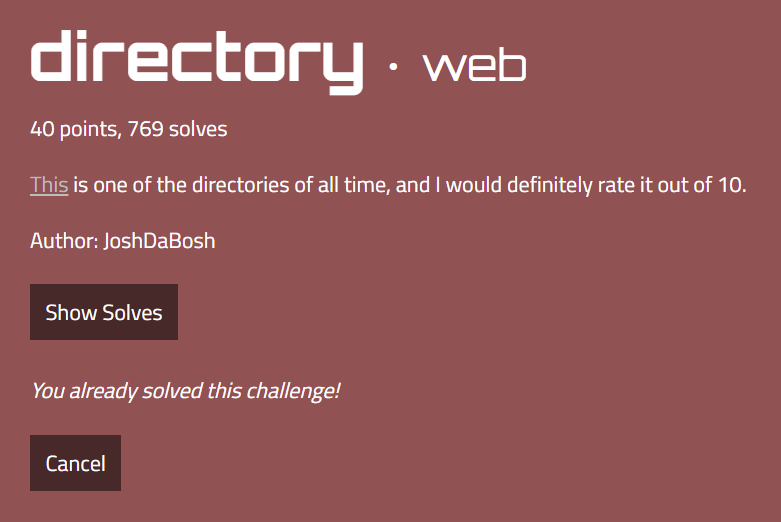

## Solution
truy cập trang web và mình nhận được giao diện chứa 5000 cái page và flag sẽ nằm 1 trong số page này.
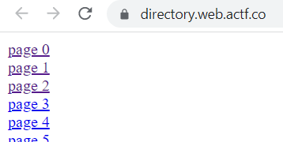

Mình đã thực hiện brute-force và tìm thấy flag tại vị trí này

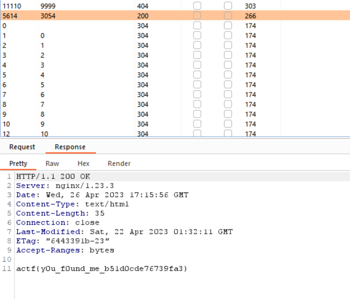

flag: actf{y0u_f0und_me_b51d0cde76739fa3}


# Celeste Tunneling Association
WEB

40 Point

## Description
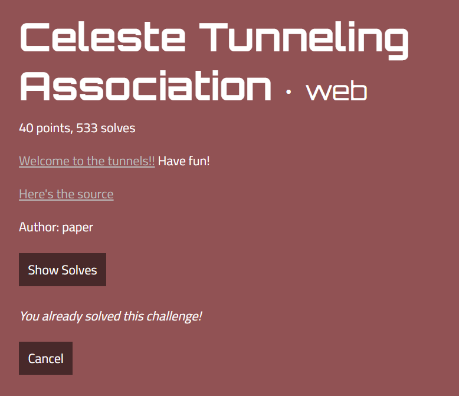

## Solution
sau khi tải source code về thì mình thấy flag được lưu trong 1 biến có tên là FLAG
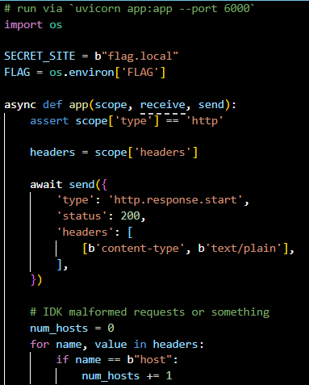

và nếu như header host tồn tại và có giá trị bằng với SECRET_SITE thì flag sẽ được in ra.

```js
    if num_hosts == 1:
        for name, value in headers:
            if name == b"host" and value == SECRET_SITE:
                await send({
                    'type': 'http.response.body',
                    'body': FLAG.encode(),
                })
                return
```

lệnh: curl -H "host: flag.local" https://pioneer.tailec718.ts.net

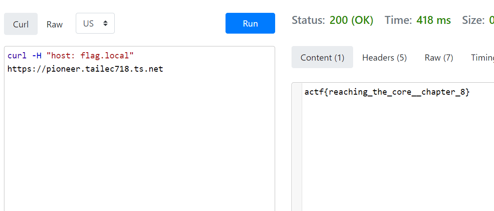


flag: actf{reaching_the_core__chapter_8}