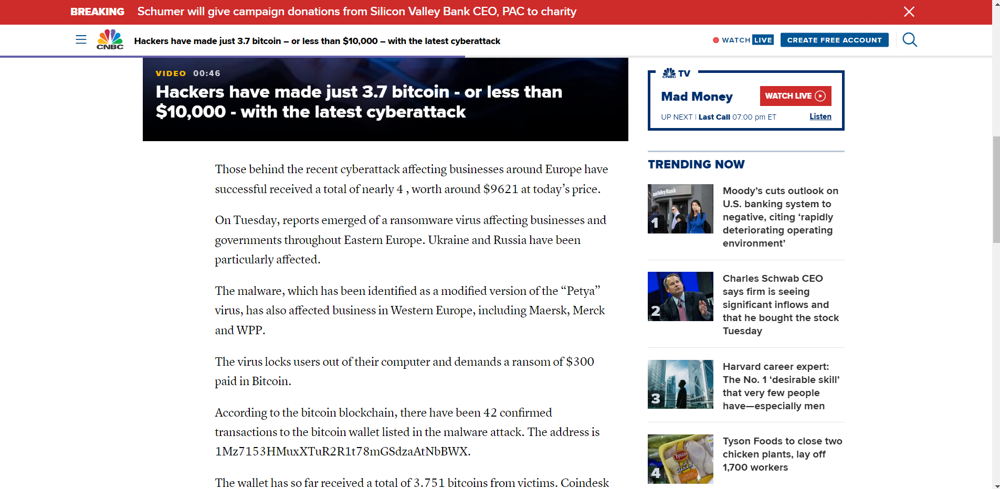
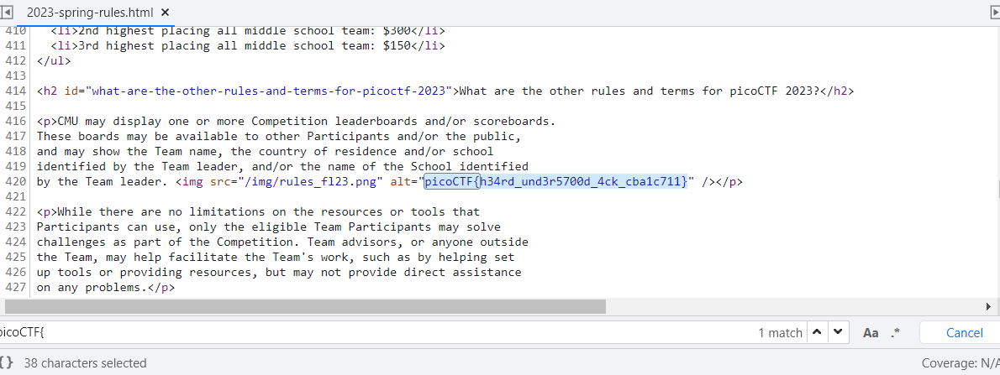
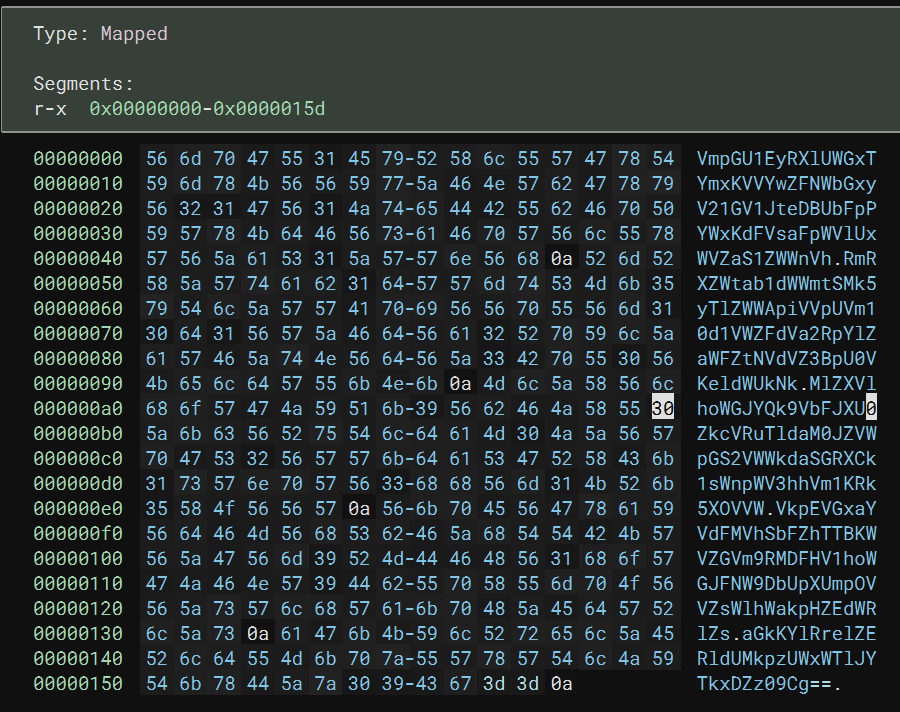
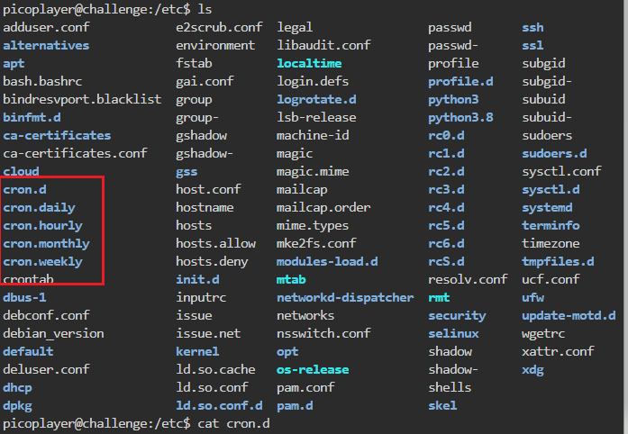
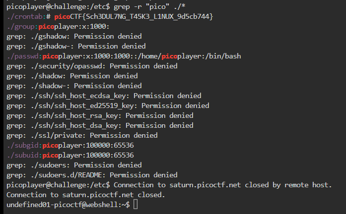
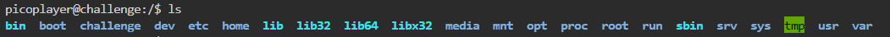
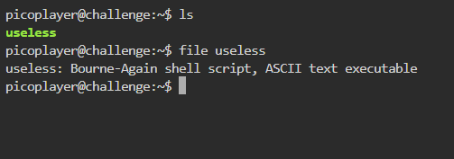
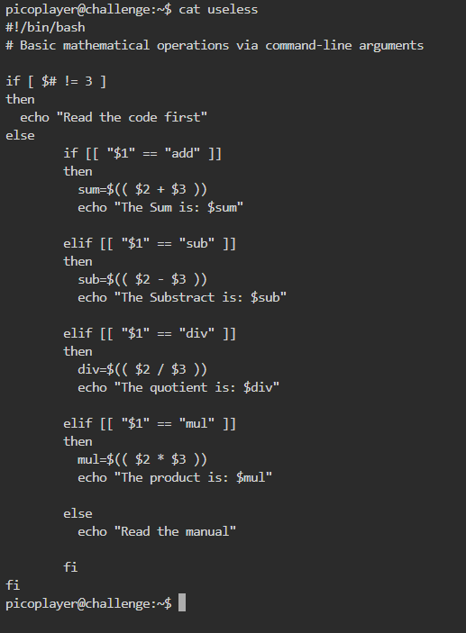

# money-ware (Generall Skill)

## Description: 
> Flag format: picoCTF{Malwarename}
> The first letter of the malware name should be capitalized and the rest lowercase.
> Your friend just got hacked and has been asked to pay some bitcoins to 1Mz7153HMuxXTuR2R1t78mGSdzaAtNbBWX. He doesn’t seem to understand what is going on and asks you > for advice. Can you identify what malware he’s being a victim of?

## Hint
> Some crypto-currencies abuse databases exist; check them out!
> Maybe Google might help.

## Solution

Trước hết thì đề bài cung cấp một cái token hay gì đó liên quan tới bitcoin và yêu cầu tìm tên mã độc gì đó liên quan tới token này.

Key search google: 1Mz7153HMuxXTuR2R1t78mGSdzaAtNbBWX bitboin malware

Mình tìm được bài viết này:  https://www.cnbc.com/2017/06/28/ransomware-cyberattack-petya-bitcoin-payment.html

Ở đây, bài viết nói rằng mã độc đó tên là: Petya



Flag: picoCTF{Petya}


# Rules 2023 (Generall Skill)

## Description:
> Read the rules of the competition and get a little bonus!
> https://picoctf.org/competitions/2023-spring-rules.html

## Hint: 
> Ctrl-F will not work

## Solution:

Ồ đề bài nói rằng CTF-F không hoạt động nhưng ta lại cần phải tìm ra flag trong nội dung của blog này.

Mình đã vào source và ctf-f trong đó và tìm thấy flag.



Flag: picoCTF{h34rd_und3r5700d_4ck_cba1c711}


# epetitions (Generall Skill)

## Description:
> Can you make sense of this file?
> Download the file: enc_flag.

## Hint:
> Multiple decoding is always good.

## Solution: 
Đầu tiên, mình làm theo đề bài tài file kia về. Có vẻ như là một file thực thi. Mình tiến hành mở file bằng BInary Ninja thì thu được thông tin sau:


Ồ, có vẻ như là một đoạn mã base64.
>VmpGU1EyRXlUWGxTYmxKVVYwZFNWbGxyV21GV1JteDBUbFpPYWxKdFVsaFpWVlUxWVZaS1ZWWnVhRmRXZWtab1dWWmtSMk5yTlZWWApiVVpUVm10d1VWZFdVa2RpYlZaWFZtNVdVZ3BpU0VKeldWUkNkMlZXVlhoWGJYQk9VbFJXU0ZkcVRuTldaM0JZVWpGS2VWWkdaSGRXCk1sWnpWV3hhVm1KRk5XOVVWVkpEVGxaYVdFMVhSbFZhTTBKWVZGVm9RMDFHV1hoWGJFNW9DbUpXUmpOVVZsWlhWakpHZEdWRlZsaGkKYlRrelZERldUMkpzUWxWTlJYTkxDZz09Cg==

Cho vào cyber chef decode base64 6 lần thì mình thu được flag.

Flag: picoCTF{base64_n3st3d_dic0d!n8_d0wnl04d3d_1bfa7005}


# chrono (General Skill)
100 Point

## Description:
> How to automate tasks to run at intervals on linux servers? Additional details will be available after launching your challenge instance.
```
Use ssh to connect to this server:
Server: saturn.picoctf.net
Port: 58423
Username: picoplayer 
Password: ekj2GJuiv4
```

## Hint:
> 

## Solution:
Đăng nhập SSH server
Theo như yêu cầu: đề bài hỏi rằng làm thế nào để tự động hoá các tác vụ chạy trên Linux
Mình nghĩ ngay tới crontab, đùa thôi mình tra mạng đó. 
Trên linux thư mục này nằm trong /etc
Mình dùng lệnh này để tìm kiếm flag: grep -r "pico" /etc




Được rồi chạy lên trên find flag xem sao thì mình thấy được flag luôn:



Flag được lưu trong file crontab

Flag: picoCTF{Sch3DUL7NG_T45K3_L1NUX_9d5cb744}


# Permissions (General Skill)
100 Point

## Description:
> Can you read files in the root file? Additional details will be available after launching your challenge instance.
```
ssh -p 60467 picoplayer@saturn.picoctf.net
Password: Sd9KYTm5kr
```

## Hint:
>

## Solution:

Tương tự bài trên mình tiếp tục đăng nhập ssh server.
Để bài yêu cầu đọc file hệ thống? hmmmm

MÌnh liệt kê các thư mục tron thư mục gốc thì có kết quả sau.



Trong đó có thư mục challenge rất khả nghi, đọc hết file thì mình tìm thấy flag.

```
challenge/metadata.json:{"flag": "picoCTF{uS1ng_v1m_3dit0r_89e9cf1a}", "username": "picoplayer", "password": "Sd9KYTm5kr"}
picoplayer@challenge:/$ Connection to saturn.picoctf.net closed by remote host.
```

Flag: picoCTF{uS1ng_v1m_3dit0r_89e9cf1a}


# useless (Generall Skill)
100 Point

## Description:
> có một tập lệnh thú vị trong thư mục chính của người dùng.
```
The work computer is running SSH. We've been given a script which performs some basic calculations, explore the script and find a flag.
Hostname: saturn.picoctf.net
Port:     53481
Username: picoplayer
Password: password
```

## Hint:
>

## Solution:
Khi mifh login vào server ssh thì nhận được một tệp tin trong như sau:



Đây là một script.

Chạy thử file thì thấy thông báo sau:
```
picoplayer@challenge:~$ ./useless
Read the code first
```

Mình quay lại thử đọc code nó xem sao thì nhận được script sau:



