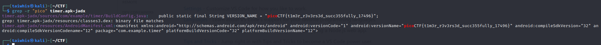
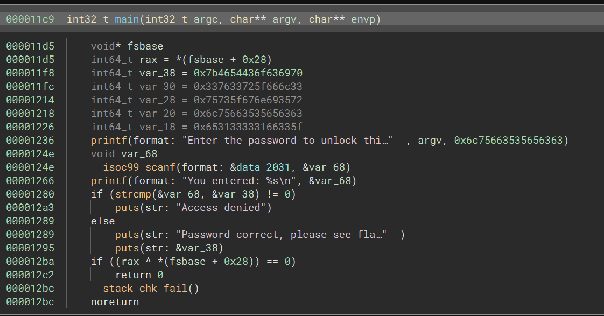
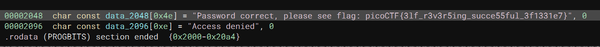
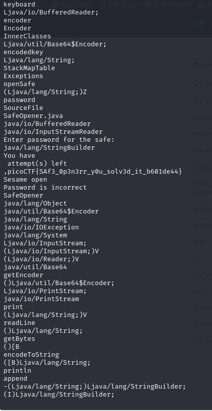

# timer (RE)
100 Point

## Description:
>You will find the flag after analysing this apk
> Download here timer.apk.

## Hint:
> Decompile
> mobsf or jadx

## Solution:

Trước hết thì theo đề bài, mình thực hiện tải file timer.apk về máy

Đề bài gợi ý dùng mobsf và jadx nhưng mình sẽ dùng ReverseAPK để decompile

Sau khi Decompile thì mình có được các thư mục và file này:  timer.apk-jadx  timer.apk.jar  timer.apk-strings.txt  timer.apk-unpacked  timer.apk-unzipped

Mình test thử với lệnh : `grep -r "pico" timer.apk-jadx` thì nhận được flag luôn ạ 

Flag: picoCTF{t1m3r_r3v3rs3d_succ355fully_17496}

# Reverse (RE)
100 Point

## Description:
>Try reversing this file? Can ya?. I forgot the password to this file. Please find it for me?
> file name: ret

## Hint:
> 

## Solution:
Ồ, đề bài cung cấp một file ret . Mình đưa vào Binary Ninja và ...
Trước tiên đọc dữ liệu hàm main xem có gì nào?

File này khi thực thi sẽ yêu cầu nhập password, nhập xong thì password sẽ được phản hồi trở lại , sau đó hàm thực hiện so khớp giữa hai beiesn &var_68 và &var_38
Nếu khớp thì hàm sẽ trả về flag.

oke , mình truy xem câu Password correct đó đến từ đâu thì thấy flag luôn nè.

Flag:  picoCTF{3lf_r3v3r5ing_succe55ful_3f1331e7}

# Safe Opener 2 (RE)
100 Point

## Description:
> What can you do with this file?
> I forgot the key to my safe but this file is supposed to help me with retrieving the lost key. Can you help me unlock my safe?

## Hint:
> Download and try to decompile the file. 
> File name: SafeOpner.class

## Solution:

Mình Strings cái thấy flag luôn:

Flag: picoCTF{SAf3_0p3n3rr_y0u_solv3d_it_b601de44}

