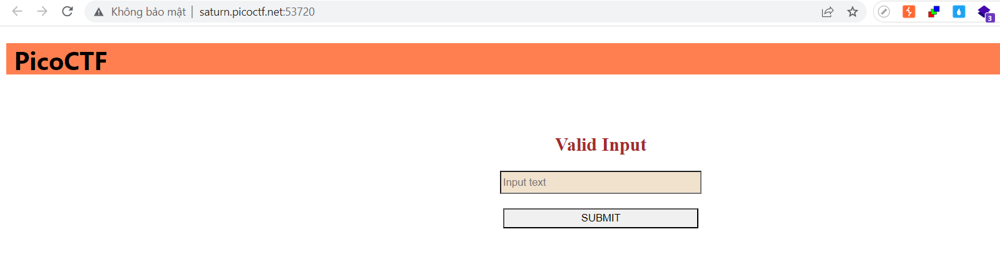
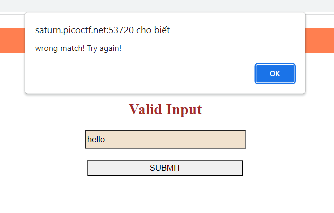
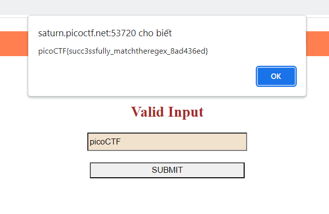

# MatchTheRegex (WEB)
100 Point

## Description:
> How about trying to match a regular expression. Additional details will be available after launching your challenge instance.
> http://saturn.picoctf.net:53720/

## Hint:
> Access the webpage and try to match the regular expression associated with the text field

## Solution:

Trước hết thì mình vẫn cứ là truy cập url. vì đề bài bảo rằng so khớp regex nên chắc chắn bài này cần nhập cái gì đấy vào cho khớp regex rồi sẽ nhận được flag



Mình thử nhập: hello thì kết quả sai. Nhưng chún ta cần tìm ra cái regex nó nằm ở đâu nữa


Đọc source code thì mình tìm thấy một hàm mã JS 
```javascript
<script>
	function send_request() {
		let val = document.getElementById("name").value;
		// ^p.....F!?
		fetch(`/flag?input=${val}`)
			.then(res => res.text())
			.then(res => {
				const res_json = JSON.parse(res);
				alert(res_json.flag)
				return false;
			})
		return false;
	}

</script>
```

Hàm này lấy dữ liệu từ biến name và fetch tới server . Ồ có một cái comment, hình như đó là regex: không gì khác mình nghĩ ngay tới picoCTF luôn ;>
Mình nhập vào input thì nhận được flag.



Flag: picoCTF{succ3ssfully_matchtheregex_8ad436ed}