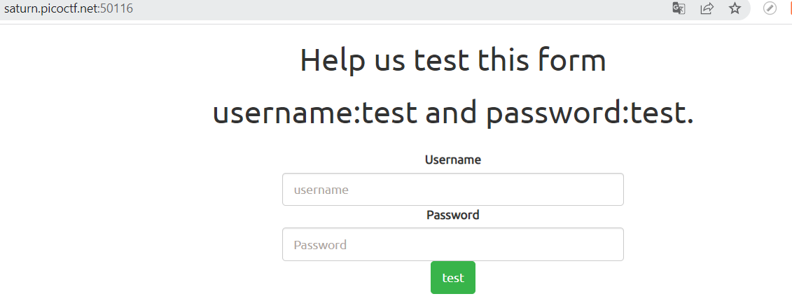
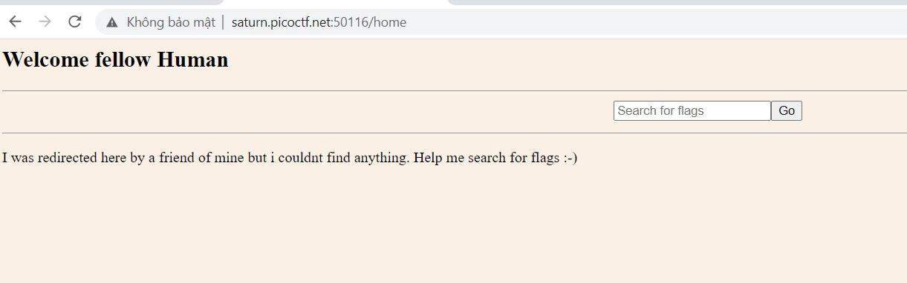
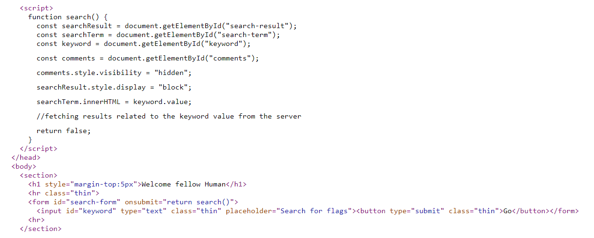
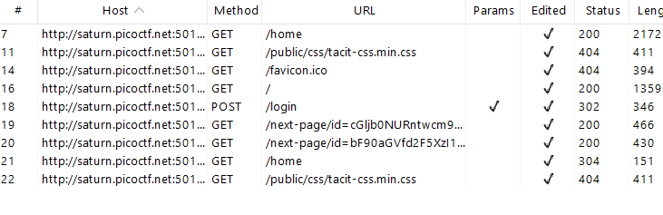
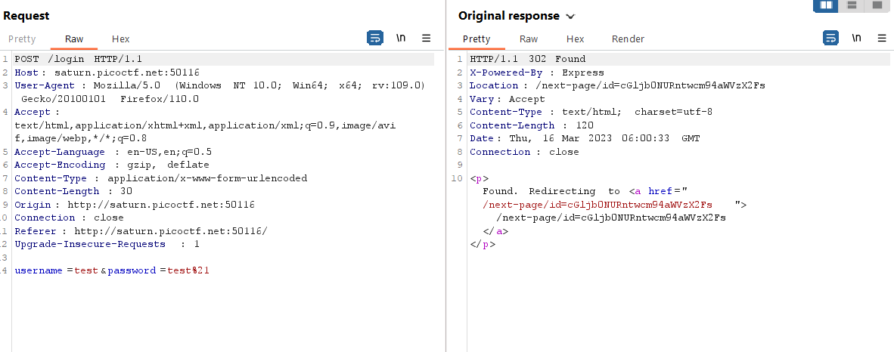

# Findme (WEB)
100 Point

## Description:
> Help us test the form by submiting the username as test and password as test!. Additional details will be available after launching your challenge instance.
> link: http://saturn.picoctf.net:50116/

## Hint:
> any redirections?

## Solution:

Đầu tiên thì mình được cấp cho một cái URL, mình truy cập vào. Theo như gợi ý của đề bài thì thông tin đăng nhập là `test` và `test!`.

Mình thực hiện login vào trong và nhận được một chuyển hướng tới trang home

Tại đây có một ô search flag, mình thư search nhưng lại chả thấy kết quả gì trả về.

Đọc source code thì mình nhận được một đoạn mã JavaScript lạ lạ như này:

Có vẻ như kết quả search được ẩn đi. Tuy nhiên, kể cả thế thì mình cũng vẫn không thấy có gì có thể khai thác được.

Mình sử dụng BurpSuite để bắt request thì thấy quá trình login có những request và phản hồi sau:

Nhớ lại thì đề bài có gợi ý về bất kỳ sự chuyển hướng nào.

Tại request chuyển iD, mình phát hiện sau khi login trang web chuyển hướng sang: `/next-page/id=cGljb0NURntwcm94aWVzX2Fs`

Vài khi chuyển hướng sang thì web lại tiếp tục chuyển hướng sang: `/next-page/id=bF90aGVfd2F5XzI1YmJhZTlhfQ==`

Rồi trả về trang home, quá trình này diễn ra nhanh nên mình không để ý, và khi bắt request bằng burp thì mới nhận ra.

Trong các trang chuyển hướng trên mình thu được 2 phần mã base64 chắc chắn chính là flag rồi.

mã base64 đầy đủ: cGljb0NURntwcm94aWVzX2FsbF90aGVfd2F5XzI1YmJhZTlhfQ==  bây giờ decode nó ra nhé.

Flag: picoCTF{proxies_all_the_way_25bbae9a}

